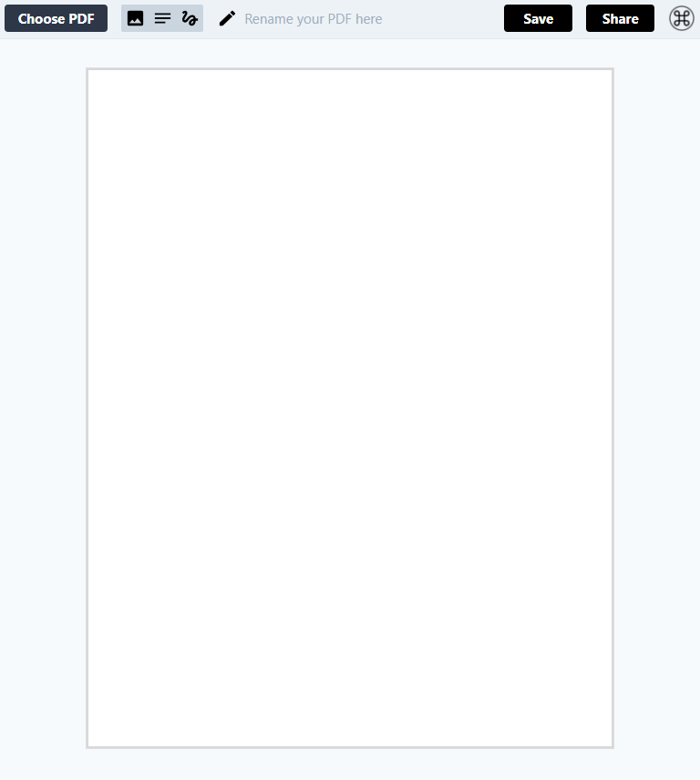

# EthicalSign

EthicalSign provides a simple and secure way to share, edit, and sign documents in your browser.




## How to build 
```
npm i 
npm run dev
```

## How to use 

1. Click `Choose PDF` to upload a `.pdf` file.
2. Add images, signatures, text to your PDF.
3. Click `Save`.

## Features

- Resize and move everything.
- Add signatures.
- Adjust line height, font size, font family.
- Mobile friendly.
- Drag and drop to upload your PDF.

---

This project includes code from [ShizukuIchi/pdf-editor](https://github.com/ShizukuIchi/pdf-editor).
LICENSE MIT © 2024 EthicalAI

